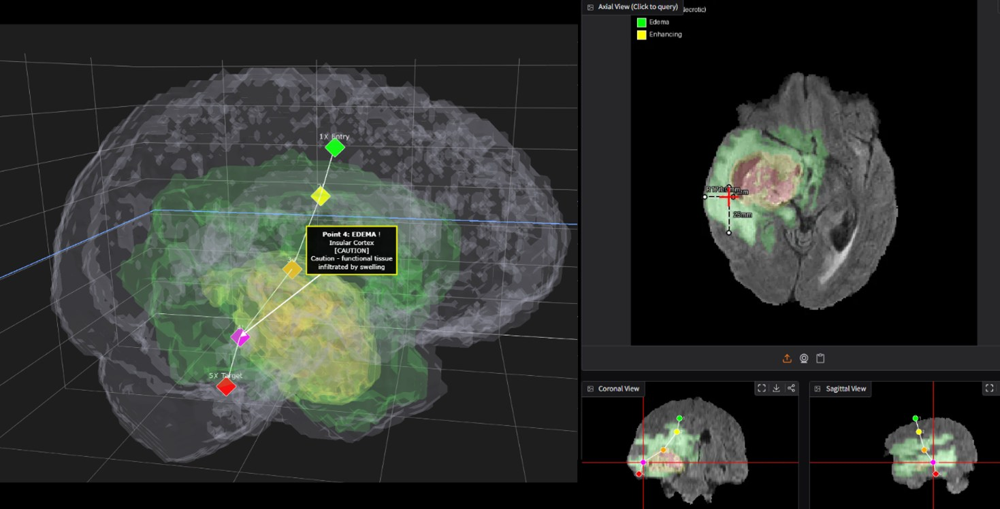
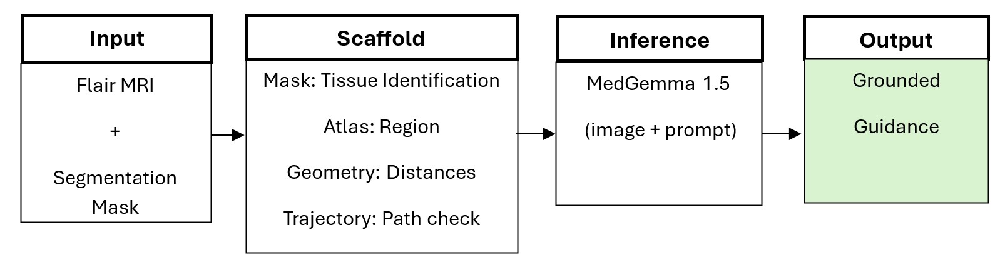

# MedGemma 1.5 Surgical Navigation Assistant

Submission for the [MedGemma Impact Challenge](https://www.kaggle.com/competitions/med-gemma-impact-challenge) on Kaggle.

**Video:** [3-minute demo on YouTube](https://www.youtube.com/watch?v=yErP1TeWgu0)

Hugging Face weights https://huggingface.co/Summicron50mm/medgemma-surgical-nav

## Problem

Small VLMs are capable of being deployed on operating room hardware but show hallucination risk in the clinical setting.

**Scaffolding allows the model to reason with grounded facts ensuring locations and measurements do not have to be discovered during inference.**

Ground-truth segmentation masks, a brain atlas, and deterministic
geometry tools supply 100% accurate tissue types, distances, and
volumes via prompt injection.  

## Architecture





## Results

### Tissue Classification (single-slice, crosshair)

| Method | Tumor | Edema |
|--------|:---:|:---:|
| MedGemma 1.5-IT (base) | 100% | 0% |
| + LoRA fine-tune | 67% | 89% |
| + GT Scaffold | 100% | 100% |

Base MedGemma exhibits class collapse, so it always predicts tumor.  The scaffold
eliminates this by looking up ground-truth labels directly allowing for edema to be a valid option for classification.

### Reasoning Distillation (multi-slice trajectory)

| Metric | Base MedGemma | Distilled Fine-Tune | Teacher (Gemini 3 Flash) |
|--------|:---:|:---:|:---:|
| Grounding | 90% | 95% | 95% |
| Quality Score (0-4) | 2.3 | 3.2 | 3.6 |
| Per-slice accuracy | 47% | **79%** | 81% |

Gemini 3 Flash was used to generate reasoning traces over 5 point trajectories which were fact checked using the scaffold system. These traces were then used as fine tuning data for MedGemma 1.5 allowing for the student model to show results comparable to the teacher model at a much smaller size. This also significantly improved the navigation style language which made the multi-slice capabilities more practical for a surgical setting.

See [`evaluation/`](evaluation/) for scripts and full results.

## Repository Structure

```
Navigation_Assistant/    Main application (7 modules)
    data/                Sample BraTS scan + bundled atlas
    checkpoints/         Bundled LoRA adapters (tissue + reasoning)
    app.py               Gradio UI entry point
    config.py            Constants, tissue labels, paths
    state.py             Global state singleton
    tools.py             Scaffold tools (mask, atlas, distances, volumes)
    inference.py         Model loading and inference
    rendering.py         Image rendering, overlays, 3-D view
    handlers.py          Gradio event handlers

evaluation/              Distillation experiment scripts + results
    generate_reasoning_traces.py
    train_reasoning_lora.py
    eval_reasoning.py
    results/             Pre-computed eval output
```

## Quick Start

```bash
cd Navigation_Assistant
pip install -r requirements.txt
python app.py
```

Requires an NVIDIA GPU with 8+ GB VRAM.  See
[`Navigation_Assistant/README.md`](Navigation_Assistant/README.md) for
full setup instructions.

## Acknowledgments

- [MedGemma 1.5](https://developers.google.com/health-ai-developer-foundations/medgemma/model-card) (Sellergren et al., 2025) by Google
- [BraTS 2021](https://www.cancerimagingarchive.net/analysis-result/rsna-asnr-miccai-brats-2021/)
  brain tumor segmentation benchmark (Baid et al., arXiv:2107.02314, 2021)
- [Harvard-Oxford Atlas](https://nilearn.github.io/dev/modules/description/harvard_oxford.html)
  (Desikan et al., 2006; distributed by FSL, FMRIB, University of Oxford)
- [Gemini 3 Flash](https://storage.googleapis.com/deepmind-media/Model-Cards/Gemini-3-Flash-Model-Card.pdf) for teacher trace generation

## License

[Apache 2.0](LICENSE)
